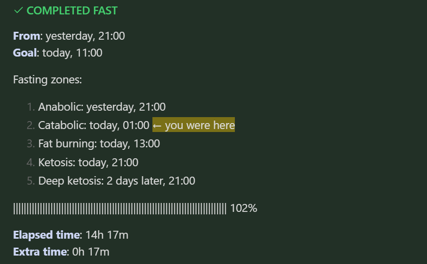

# Fastimer ⌛ ⏲️ ⌚

It is a plugin for [Obsidian](https://obsidian.md) designed to help you monitor your [fasting intervals](https://en.wikipedia.org/wiki/Intermittent_fasting).  

## 🙂 How to use it?

The idea is simple: when you start a new fast and want to track it, you add a `fastimer` code block. In the block, you set a date and time when you started. You can do this using "Insert fasting tracker" command or manually.

For instance:

````
```fastimer
2024-02-06 18:50
```
````

The plugin takes the code block and shows elapsed time, remaining time, and something like a progress bar to visualize your spilled blood, sweat, and tears :)

Here is an example:



Everything above updates when a block is being rendered. To trigger this, you can edit the block or reopen the note.

To mark an active fast as finished, you can add the date and time of the moment to the same block. By the way, there is "Insert current date & time" command to do so.

````
```fastimer
2024-02-06 18:50
2024-02-07 15:00
```
````

## 🤔 Questions

### How do I set a fasting interval's length?

It is assumed that the length of a regular fast is 16 hours, since it is pretty popular. However, you can change the default value in the plugin's settings or set it directly for one specific fast. 

Below, we are going to fast for 18 hours:

````
```fastimer
18
2024-02-06 18:50
```
````